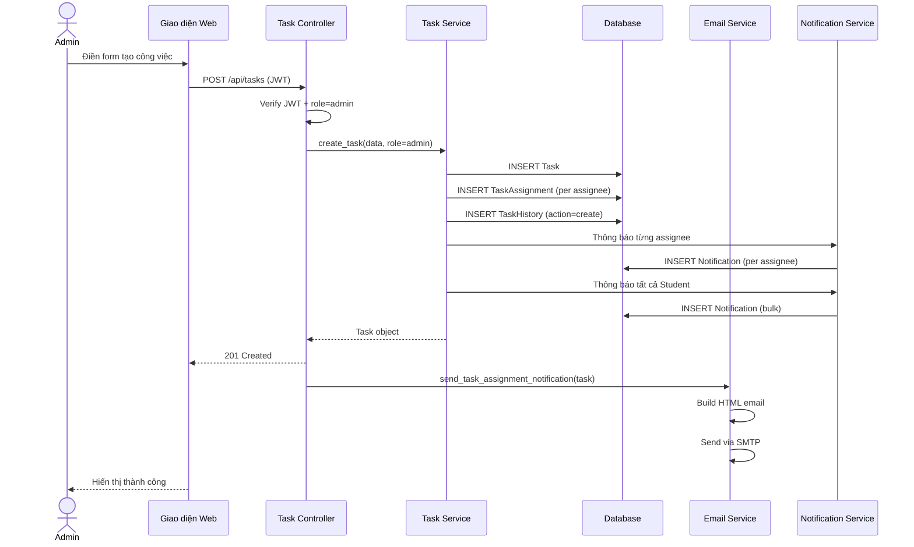
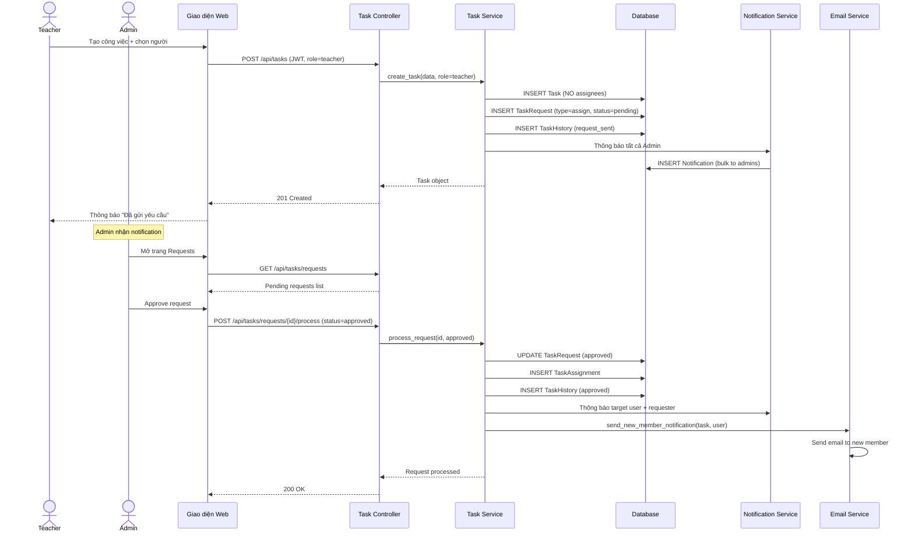
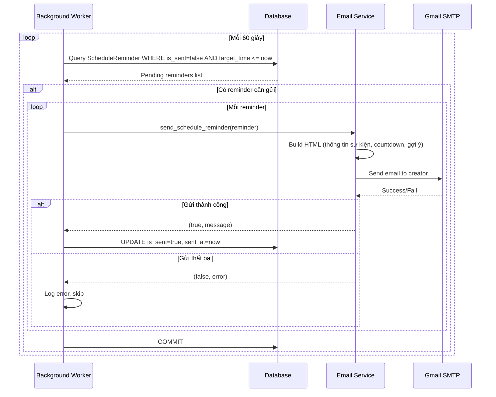
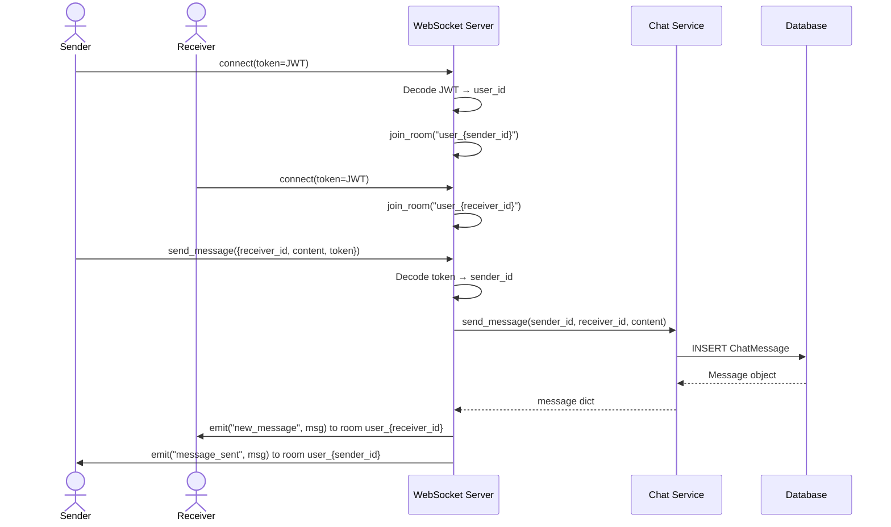
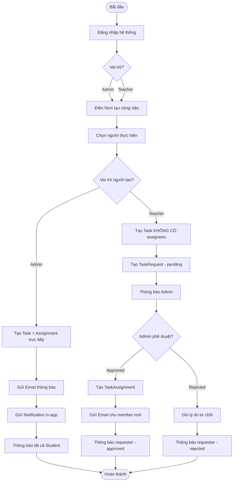
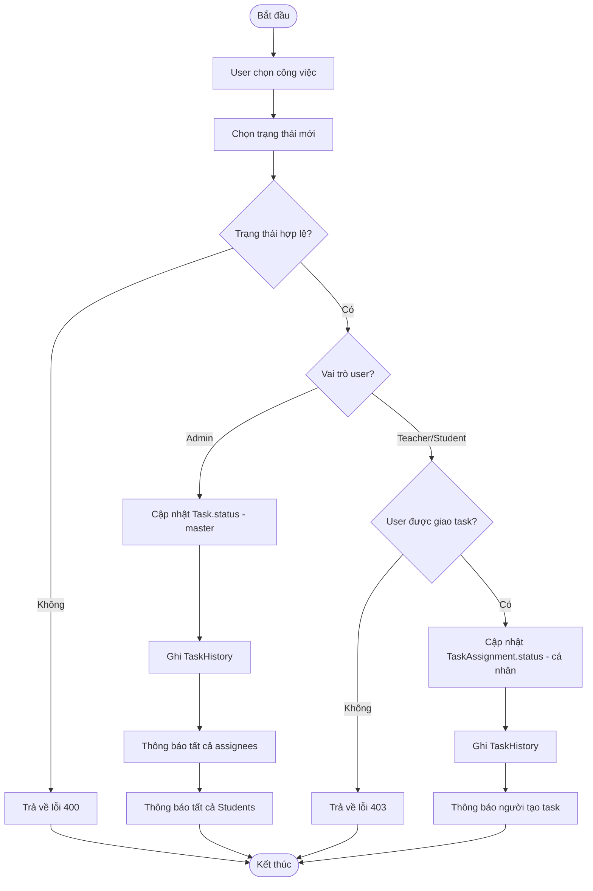
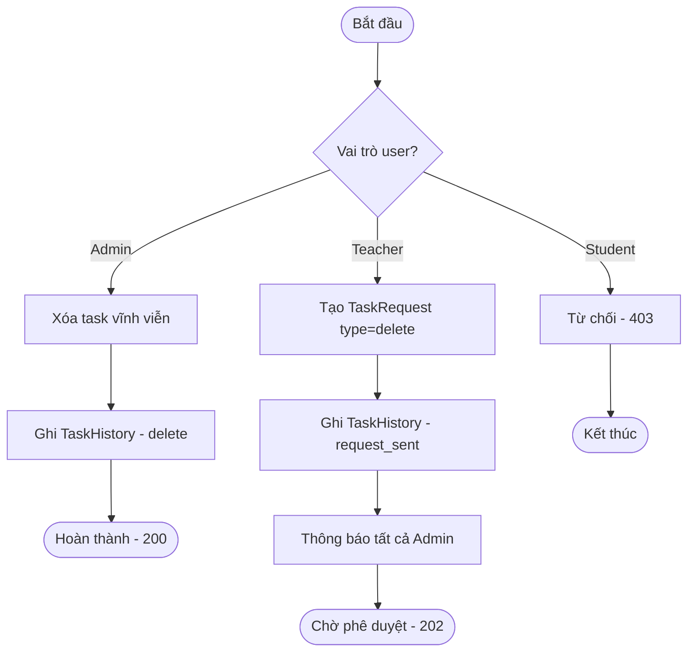
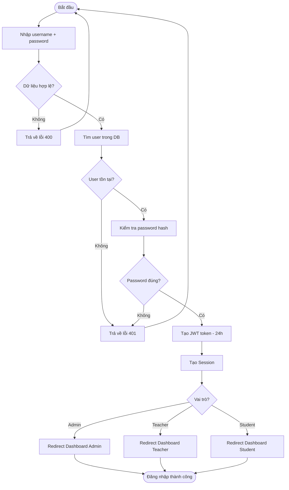

# TÀI LIỆU YÊU CẦU NGHIỆP VỤ & ĐẶC TẢ PHẦN MỀM
# HỆ THỐNG QUẢN LÝ CÔNG VIỆC GIÁO DỤC — EDUTASK

---

**Tên dự án:** EduTask – Hệ thống Quản lý Công việc Giáo dục  
**Phiên bản:** 2.0  
**Ngày tạo:** 21/03/2026  
**Người tạo:** Business Analyst  
**Trạng thái:** Bản thảo (Draft)

---

# PHẦN A – TÀI LIỆU YÊU CẦU NGHIỆP VỤ (BRD)

---

## 1. Tóm tắt điều hành (Executive Summary)

**EduTask** là hệ thống quản lý công việc trực tuyến dành riêng cho môi trường giáo dục đại học. Hệ thống giải quyết bài toán phân công công việc rời rạc, thiếu minh bạch giữa Ban quản trị, Giảng viên và Sinh viên bằng cách cung cấp nền tảng số hóa tập trung.

**Các giá trị cốt lõi:**

- **Minh bạch hóa** quy trình giao việc với cơ chế phê duyệt nhiều cấp
- **Tự động hóa** thông báo và nhắc hẹn lịch học qua email
- **Tập trung hóa** tài liệu, lịch trình, giao tiếp trên một nền tảng duy nhất
- **Phân quyền rõ ràng** với 3 vai trò: Quản trị viên, Giảng viên, Sinh viên

---

## 2. Tổng quan dự án (Project Overview)

### 2.1 Bối cảnh

Trong môi trường giáo dục đại học, việc phân công công việc, theo dõi tiến độ, chia sẻ tài liệu và trao đổi thông tin thường diễn ra rời rạc qua nhiều kênh khác nhau (email, Zalo, giấy tờ). Điều này tạo ra:

- Khó khăn trong việc tổng hợp và theo dõi tiến độ
- Thiếu minh bạch trong quy trình phân công
- Mất thời gian do thiếu tự động hóa
- Thông tin bị phân tán, khó tra cứu

### 2.2 Giải pháp

EduTask cung cấp một ứng dụng web tập trung với các module:

| Module | Mô tả |
|--------|-------|
| Quản lý Người dùng | Đăng ký, đăng nhập, phân quyền 3 cấp |
| Quản lý Công việc | Tạo, giao, theo dõi, phê duyệt công việc |
| Quản lý Lịch trình | Calendar view cho lớp học, thi, họp |
| Nhắc hẹn tự động | Email nhắc nhở trước sự kiện |
| Quản lý Tài liệu | Upload, phân loại, tìm kiếm, download |
| Hỏi đáp Q&A | Diễn đàn hỏi-đáp học thuật |
| Chat thời gian thực | Nhắn tin 1-1 via WebSocket |
| Thông báo | In-app notification + Email |
| Năm học | Quản lý năm học và học kỳ |
| Giám sát | Health check, Prometheus, Grafana |

### 2.3 Công nghệ

| Thành phần | Công nghệ |
|------------|-----------|
| Backend | Python Flask, SQLAlchemy ORM |
| Database | SQLite (mở rộng PostgreSQL/MySQL) |
| Xác thực | JWT + Session |
| Real-time | Flask-SocketIO + Redis |
| Email | SMTP Gmail via Flask-Mail |
| Container | Docker + Docker Compose |
| Monitoring | Prometheus + Grafana |
| Proxy | Nginx |
| Hosting | Hugging Face Spaces (Port 7860) |

---

## 3. Mục tiêu kinh doanh (Business Objectives)

| STT | Mục tiêu | KPI |
|-----|----------|-----|
| 1 | Số hóa 100% quy trình giao việc | Tất cả công việc được tạo trên hệ thống |
| 2 | Giảm 50% thời gian phân công | So sánh với quy trình thủ công |
| 3 | Đảm bảo audit trail đầy đủ | 100% hành động có lịch sử |
| 4 | Tăng tương tác GV-SV | Tỷ lệ sử dụng Chat + Q&A ≥ 70% |
| 5 | Tự động nhắc nhở lịch học | 100% sự kiện có email nhắc |
| 6 | Tập trung tài liệu | 100% tài liệu lưu trên hệ thống |

---

## 4. Phạm vi (Scope)

### 4.1 Trong phạm vi

- Quản lý người dùng (CRUD, phân quyền, kích hoạt/vô hiệu hóa)
- Quản lý công việc (CRUD, giao việc, Kanban board, lịch sử)
- Quy trình phê duyệt (giao việc/xóa/rút cần Admin duyệt)
- Quản lý lịch trình (Calendar, lọc theo GV/học kỳ)
- Nhắc hẹn tự động qua email
- Quản lý tài liệu (upload/download/phân loại)
- Hỏi đáp Q&A
- Chat real-time (WebSocket 1-1)
- Thông báo (in-app + email)
- Dashboard thống kê theo vai trò
- Quản lý năm học
- Giám sát hệ thống (health check, metrics)

### 4.2 Ngoài phạm vi

- Ứng dụng di động (Mobile App)
- Tích hợp LMS (Moodle, Google Classroom)
- Video conferencing
- Chấm điểm / Xếp loại sinh viên
- Thanh toán / Học phí trực tuyến
- Push notification trình duyệt
- Tích hợp ERP trường đại học

---

## 5. Các bên liên quan (Stakeholders)

| Vai trò | Đại diện | Trách nhiệm |
|---------|----------|--------------|
| Product Owner | Ban giám hiệu / Phòng đào tạo | Phê duyệt yêu cầu, ưu tiên tính năng |
| Admin | Nhân viên CNTT | Quản lý user, phê duyệt, giám sát |
| Teacher | Giảng viên các khoa | Tạo công việc, lịch, tài liệu |
| Student | Sinh viên | Xem lịch, tải tài liệu, Q&A, chat |
| Dev Team | Kỹ sư phần mềm | Phát triển, triển khai hệ thống |

---

## 6. Chân dung người dùng (User Personas)

### Persona 1: Quản trị viên (Admin)
- **Mục tiêu:** Quản lý toàn bộ hệ thống, phê duyệt yêu cầu
- **Quyền hạn:** Toàn quyền – CRUD user, giao việc trực tiếp, phê duyệt/từ chối request, quản lý năm học, health check
- **Đặc điểm:** Có kiến thức CNTT, cần overview toàn hệ thống

### Persona 2: Giảng viên (Teacher)
- **Mục tiêu:** Phân công công việc, quản lý lịch dạy, chia sẻ tài liệu
- **Quyền hạn:** Tạo task (cần duyệt khi giao), tạo lịch, upload tài liệu, trả lời Q&A, chat
- **Đặc điểm:** Cần giao diện đơn giản, thao tác nhanh

### Persona 3: Sinh viên (Student)
- **Mục tiêu:** Theo dõi lịch học, tải tài liệu, hỏi đáp
- **Quyền hạn:** Xem lịch, download tài liệu, đặt câu hỏi Q&A, chat với GV/Admin
- **Đặc điểm:** Chủ yếu tiêu thụ thông tin, ít quyền tạo nội dung

---

## 7. Yêu cầu chức năng (Functional Requirements)

### FR-01: Xác thực & Phân quyền

| Mã | Tính năng | Input | Xử lý | Output |
|----|-----------|-------|--------|--------|
| FR-01.1 | Đăng ký | username, email, password, full_name, role, phone, student_id, department | Validate → Hash password (Werkzeug) → Lưu DB | User object + thông báo |
| FR-01.2 | Đăng nhập | username, password | Validate → Check hash → Tạo JWT (24h) + Session | JWT token + user info + redirect dashboard |
| FR-01.3 | Đăng xuất | Session cookie | Xóa session | Redirect login page |
| FR-01.4 | Cập nhật cài đặt | full_name, phone, department, reminder_preference | Validate allowed fields → Update DB + Session | User updated |

### FR-02: Quản lý Người dùng (Admin)

| Mã | Tính năng | Input | Xử lý | Output |
|----|-----------|-------|--------|--------|
| FR-02.1 | Danh sách | page, per_page, q (search) | Query DB với pagination + search | Paginated user list |
| FR-02.2 | Tạo user | username, email, full_name, role, password (default "123456") | Validate unique → Hash → Save | New user |
| FR-02.3 | Cập nhật | user_id + any field | Find → Update fields → Save | Updated user |
| FR-02.4 | Toggle Active | user_id | Find → is_active = !is_active → Save | Status changed |
| FR-02.5 | Xóa user | user_id | Check self-delete → Delete | Confirmation |

### FR-03: Quản lý Công việc

| Mã | Tính năng | Input | Xử lý | Output |
|----|-----------|-------|--------|--------|
| FR-03.1 | Tạo task | title, description, priority, due_date, course_name, course_code, class_group, semester, academic_year, assignee_ids | **Admin:** Tạo + giao trực tiếp + email + thông báo SV. **Teacher:** Tạo + tạo TaskRequest (pending) + thông báo Admin | Task object |
| FR-03.2 | Xem tasks | semester, academic_year, status, search, page | **Admin:** tất cả. **Teacher:** created + assigned. **Student:** assigned only | Paginated task list |
| FR-03.3 | Cập nhật task | task_id + fields + assignee_ids | Update fields. **Admin:** sửa assignees trực tiếp. **Teacher:** tạo request thêm assignee. Thông báo assignees + SV | Updated task |
| FR-03.4 | Cập nhật trạng thái | task_id, status (todo/in_progress/done) | **Admin:** cập nhật master status. **Teacher:** cập nhật assignment cá nhân. Ghi history + thông báo | Status updated |
| FR-03.5 | Xóa task | task_id | **Admin:** xóa vĩnh viễn. **Teacher:** tạo request xóa (pending). **Student:** bị từ chối (403) | Deleted / Request created |
| FR-03.6 | Rút khỏi task | task_id | **Teacher:** tạo request withdraw. **Student:** bị từ chối (403) | Request created |
| FR-03.7 | Xem lịch sử | task_id | Query TaskHistory theo task_id, desc created_at | History list |
| FR-03.8 | Thống kê | user_id (optional) | Count tasks by status + overdue + pending_requests | Stats object |

### FR-04: Quy trình Phê duyệt

| Mã | Tính năng | Input | Xử lý | Output |
|----|-----------|-------|--------|--------|
| FR-04.1 | Xem requests | (Admin only) | Query TaskRequest.status = 'pending' | Request list |
| FR-04.2 | Phê duyệt/Từ chối | request_id, status (approved/rejected), note | **Approved + assign:** Tạo TaskAssignment + email member. **Approved + delete:** Xóa task. **Approved + withdraw:** Remove assignment. **Rejected:** Ghi history. Thông báo requester | Request processed |

### FR-05: Quản lý Lịch trình

| Mã | Tính năng | Input | Xử lý | Output |
|----|-----------|-------|--------|--------|
| FR-05.1 | Tạo lịch | title, event_type, course_name, location, start_time, end_time, color | Validate → Save → Thông báo tất cả SV | Schedule object |
| FR-05.2 | Xem lịch | start, end, user_id | Filter by range + creator → Return | Schedule list (FullCalendar format) |
| FR-05.3 | Cập nhật | schedule_id + fields | Update → Thông báo SV | Updated schedule |
| FR-05.4 | Xóa | schedule_id | Delete + cascade reminders | Confirmation |

### FR-06: Nhắc hẹn

| Mã | Tính năng | Input | Xử lý | Output |
|----|-----------|-------|--------|--------|
| FR-06.1 | Cài nhắc hẹn | schedule_id, offsets[] (minutes) | Delete old → Create ScheduleReminder per offset. target_time = start_time - offset | Reminders created |
| FR-06.2 | Worker tự động | (Background, mỗi 60s) | Query is_sent=false AND target_time ≤ now → Send email → Mark sent | Emails sent |
| FR-06.3 | Gửi thủ công | (Admin trigger) | Same as worker but triggered manually | Count sent |

### FR-07: Quản lý Tài liệu

| Mã | Tính năng | Input | Xử lý | Output |
|----|-----------|-------|--------|--------|
| FR-07.1 | Upload | file, title, description, course_name, category | Validate size (≤16MB) + extension whitelist → Save to disk + DB | Document object |
| FR-07.2 | Download | doc_id | Find → Increment download_count → Send file | File download |
| FR-07.3 | Tìm kiếm | q (keyword) | Search title, description, course_name (LIKE) | Document list |
| FR-07.4 | Xóa | doc_id | Delete DB record (Admin/Teacher) | Confirmation |

### FR-08: Hỏi đáp Q&A

| Mã | Tính năng | Input | Xử lý | Output |
|----|-----------|-------|--------|--------|
| FR-08.1 | Đặt câu hỏi | title, content, course_name, course_code | Save → (tất cả user) | Question object |
| FR-08.2 | Trả lời | content, question_id | Save Answer → Link to Question | Answer object |
| FR-08.3 | Đánh dấu giải quyết | question_id | is_resolved = true | Resolved |
| FR-08.4 | Xóa câu hỏi | question_id | Delete question + cascade answers | Confirmation |

### FR-09: Chat Thời gian Thực

| Mã | Tính năng | Input | Xử lý | Output |
|----|-----------|-------|--------|--------|
| FR-09.1 | Danh sách liên hệ | user_id | **Admin:** all. **Teacher:** all. **Student:** Teacher + Admin only | Contact list |
| FR-09.2 | Gửi tin nhắn | receiver_id, content, token (WS) | Decode JWT → Save DB → Emit to receiver room → Emit back to sender | Real-time message |
| FR-09.3 | Xem hội thoại | contact_id | Get messages + Mark as read | Message list |
| FR-09.4 | Dọn dẹp | (Background worker, 3:00 AM) | Delete messages > 14 days | Deleted count |

### FR-10: Thông báo

| Mã | Tính năng | Input | Xử lý | Output |
|----|-----------|-------|--------|--------|
| FR-10.1 | Xem thông báo | user_id | Query notifications + unread_count | Notification list |
| FR-10.2 | Đánh dấu đã đọc | notification_id / all | is_read = true | Updated |
| FR-10.3 | Đếm chưa đọc | user_id | Count is_read=false | Number |

### FR-11: Quản lý Năm học

| Mã | Tính năng | Input | Xử lý | Output |
|----|-----------|-------|--------|--------|
| FR-11.1 | Tạo | start_year, end_year, is_active | Validate end=start+1, check unique. If active → deactivate others | AcademicYear |
| FR-11.2 | Kích hoạt | year_id | Deactivate all → Activate this one | Active year |
| FR-11.3 | Xóa | year_id | Check not active → Delete | Confirmation |

### FR-12: Giám sát Hệ thống

| Mã | Tính năng | Input | Xử lý | Output |
|----|-----------|-------|--------|--------|
| FR-12.1 | Health Check | (Admin API) | Test DB (SELECT 1), Storage (write access), Mail (SMTP connect), API | Status object |
| FR-12.2 | Prometheus | (Auto) | PrometheusMetrics collects Flask metrics | /metrics endpoint |

---

## 8. Yêu cầu phi chức năng (Non-functional Requirements)

| Mã | Loại | Yêu cầu |
|----|------|---------|
| NFR-01 | Hiệu năng | API response < 500ms. Phân trang mặc định 20 records/page |
| NFR-02 | Hiệu năng | WebSocket latency < 1 giây cho chat |
| NFR-03 | Hiệu năng | Background worker interval: 60 giây |
| NFR-04 | Bảo mật | Password hash Werkzeug (bcrypt-based) |
| NFR-05 | Bảo mật | JWT token expires 24 giờ |
| NFR-06 | Bảo mật | Role-based access control (decorator + session) |
| NFR-07 | Bảo mật | Upload whitelist: pdf, doc, docx, xls, xlsx, ppt, pptx, txt, zip, rar, png, jpg, jpeg |
| NFR-08 | Bảo mật | Upload max size: 16MB |
| NFR-09 | Mở rộng | Kiến trúc MVC (Model-Service-Repository-Controller) |
| NFR-10 | Mở rộng | Docker containerization, replicas via Compose |
| NFR-11 | Mở rộng | Redis message queue cho WebSocket multi-instance |
| NFR-12 | Mở rộng | Database URI cấu hình qua biến môi trường |
| NFR-13 | Usability | Dashboard riêng cho mỗi vai trò |
| NFR-14 | Usability | Email HTML chuyên nghiệp với branding EduTask |
| NFR-15 | Tin cậy | Worker daemon thread với error handling, tự phục hồi |
| NFR-16 | Tin cậy | Docker restart: unless-stopped |

---

## 9. Quy tắc nghiệp vụ (Business Rules)

| Mã | Quy tắc |
|----|---------|
| BR-01 | Teacher giao việc → phải được Admin phê duyệt |
| BR-02 | Chỉ Admin xóa task trực tiếp. Teacher phải request. Student không được xóa |
| BR-03 | Teacher yêu cầu rút khỏi task → Admin duyệt. Student không được rút |
| BR-04 | Chỉ 1 năm học active tại mỗi thời điểm |
| BR-05 | Không xóa năm học đang hoạt động |
| BR-06 | Admin không thể tự xóa chính mình |
| BR-07 | Student chỉ chat với Teacher + Admin, không chat Student khác |
| BR-08 | Tin nhắn chat tự xóa sau 14 ngày |
| BR-09 | Task chỉ giao cho Teacher, không giao cho Student |
| BR-10 | Chỉ Admin/Teacher upload tài liệu. Tất cả download |
| BR-11 | Mọi thao tác trên task → ghi vào TaskHistory (audit trail) |
| BR-12 | Mọi thay đổi task/lịch → thông báo tất cả Student |
| BR-13 | Email gửi khi: giao việc, thêm thành viên, nhắc lịch |

---

## 10. Luồng người dùng (User Flows)

### Flow 1: Admin giao công việc
1. Admin đăng nhập → Dashboard Admin
2. Chọn "Tạo công việc" → Điền form (tiêu đề, ưu tiên, hạn, người thực hiện)
3. Hệ thống tạo Task + TaskAssignment trực tiếp
4. Gửi notification in-app cho người được giao
5. Gửi email HTML cho tất cả người liên quan
6. Gửi notification cho tất cả Student

### Flow 2: Teacher yêu cầu giao việc
1. Teacher đăng nhập → Dashboard Teacher
2. Tạo công việc → Chọn người thực hiện
3. Hệ thống tạo Task (KHÔNG CÓ assignees) + TaskRequest (pending)
4. Thông báo Admin có request mới
5. Admin mở trang "Yêu cầu chờ duyệt" → Approve/Reject
6. Nếu Approve: Tạo TaskAssignment + email + notification
7. Nếu Reject: Ghi lý do + notification cho Teacher

### Flow 3: Nhắc hẹn lịch tự động
1. Admin/Teacher tạo lịch → User cài nhắc hẹn (VD: 30 phút trước)
2. Hệ thống tạo ScheduleReminder (target_time = start_time - 30min)
3. Background worker chạy mỗi 60s, query reminder chưa gửi + target_time ≤ now
4. Gửi email HTML chuyên nghiệp → Mark is_sent = true

### Flow 4: Chat thời gian thực
1. User đăng nhập → Kết nối WebSocket với JWT token
2. Chọn liên hệ (filtered by role rules)
3. Gửi tin → WebSocket event → Server save DB → Emit to receiver room
4. Receiver nhận ngay lập tức
5. Mở hội thoại → Auto mark messages as read

### Flow 5: Teacher cập nhật tiến độ
1. Teacher xem Kanban board
2. Kéo-thả task sang cột mới hoặc click cập nhật status
3. Hệ thống cập nhật TaskAssignment.status (cá nhân, không phải master)
4. Ghi TaskHistory
5. Thông báo người tạo task về tiến độ mới

---

## 11. Giả định và ràng buộc

### Giả định
- Hệ thống triển khai trong môi trường có internet ổn định
- Người dùng có kiến thức cơ bản sử dụng web
- Gmail SMTP với App Password làm dịch vụ email chính
- SQLite đủ cho quy mô < 1000 người dùng đồng thời
- Sinh viên chủ yếu tiêu thụ thông tin, không tham gia quy trình giao việc
- 3 học kỳ mỗi năm (HK1, HK2, HK3)

### Ràng buộc
- SQLite giới hạn concurrent write operations
- Upload file tối đa 16MB
- JWT token hết hạn 24 giờ
- Tin nhắn chat chỉ lưu 14 ngày
- Port 7860 (Hugging Face Spaces)

---

## 12. Rủi ro và phụ thuộc

### Rủi ro

| Mã | Rủi ro | Mức độ | Biện pháp |
|----|--------|--------|-----------|
| R-01 | SQLite không chịu tải cao | Trung bình | Chuyển PostgreSQL khi > 500 users |
| R-02 | Gmail SMTP bị giới hạn gửi | Cao | Chuyển SendGrid/SES |
| R-03 | Mất dữ liệu khi container bị xóa | Cao | Mount volume + backup script |
| R-04 | JWT token bị đánh cắp | Trung bình | HTTPS + token rotation |
| R-05 | Worker crash | Thấp | Daemon thread + try-catch loop |

### Phụ thuộc

| STT | Phụ thuộc | Loại |
|-----|-----------|------|
| 1 | Gmail SMTP | External Service |
| 2 | Redis | Infrastructure |
| 3 | Docker | Infrastructure |
| 4 | Hugging Face Spaces | Hosting |
| 5 | Prometheus + Grafana | Monitoring |

---

## 13. Thuật ngữ (Glossary)

| Thuật ngữ | Định nghĩa |
|-----------|------------|
| Task | Đơn vị công việc được tạo và giao |
| TaskAssignment | Mối quan hệ Task ↔ Người thực hiện |
| TaskRequest | Yêu cầu phê duyệt (assign/delete/withdraw) |
| TaskHistory | Audit trail mọi thao tác trên Task |
| Schedule | Sự kiện trong lịch (lớp/thi/họp) |
| ScheduleReminder | Nhắc hẹn email trước sự kiện |
| Document | File tài liệu học tập |
| Q&A | Module hỏi-đáp (Question + Answer) |
| Notification | Thông báo hệ thống (in-app/email) |
| AcademicYear | Năm học (VD: 2024-2025) |
| Kanban Board | Bảng quản lý task dạng cột |
| JWT | JSON Web Token cho xác thực API |
| WebSocket | Giao thức real-time hai chiều |
| Background Worker | Tiến trình chạy ngầm xử lý tác vụ tự động |

---

# PHẦN B – ĐẶC TẢ PHẦN MỀM (SRS)

---

## 1. Giới thiệu

### 1.1 Mục đích
Tài liệu này mô tả chi tiết các yêu cầu kỹ thuật của hệ thống EduTask, phục vụ đội phát triển trong việc thiết kế, triển khai và kiểm thử.

### 1.2 Phạm vi
Hệ thống EduTask bao gồm 12 module chức năng chính (như mô tả trong BRD) được xây dựng trên kiến trúc Flask MVC với REST API backend và template-based frontend.

### 1.3 Định nghĩa và viết tắt
- **API:** Application Programming Interface
- **JWT:** JSON Web Token
- **CRUD:** Create, Read, Update, Delete
- **ORM:** Object-Relational Mapping
- **WS:** WebSocket
- **SMTP:** Simple Mail Transfer Protocol

---

## 2. Mô tả tổng quát

### 2.1 Kiến trúc hệ thống

```
┌─────────────┐     ┌──────────────┐     ┌──────────────┐
│   Browser   │────▶│    Nginx     │────▶│  Flask App   │
│  (Client)   │◀────│  (Reverse    │◀────│  (Python)    │
│             │     │   Proxy)     │     │              │
└─────────────┘     └──────────────┘     └──────┬───────┘
                                                │
                    ┌───────────────────────────┼───────────────┐
                    │                           │               │
              ┌─────▼─────┐            ┌────────▼──────┐ ┌─────▼─────┐
              │  SQLite   │            │    Redis      │ │   SMTP    │
              │ Database  │            │ (WebSocket    │ │  (Gmail)  │
              │           │            │  msg queue)   │ │           │
              └───────────┘            └───────────────┘ └───────────┘
```

### 2.2 Kiến trúc code (MVC + Repository Pattern)

```
app/
├── models/           ← Data Layer (SQLAlchemy ORM)
│   ├── user.py, task.py, schedule.py, chat.py,
│   ├── document.py, qna.py, notification.py,
│   ├── reminder.py, academic_year.py
├── repositories/     ← Data Access Layer
│   ├── base_repository.py (CRUD chung)
│   ├── task_repository.py, user_repository.py, ...
├── services/         ← Business Logic Layer
│   ├── task_service.py, email_service.py, ...
├── controllers/      ← API Layer (Flask Blueprints)
│   ├── auth_controller.py, task_controller.py, ...
├── views/            ← Page Routing Layer
│   ├── page_views.py (render templates)
├── utils/            ← Utilities
│   ├── decorators.py (role_required, login_required_page)
│   ├── background_tasks.py (reminder worker)
│   ├── socket_handlers.py (WebSocket events)
```

### 2.3 Database Schema

**Bảng Users**
| Cột | Kiểu | Ràng buộc |
|-----|------|-----------|
| id | Integer | PK, Auto |
| username | String(80) | Unique, Not Null, Index |
| email | String(120) | Unique, Not Null, Index |
| password_hash | String(256) | Not Null |
| full_name | String(150) | Not Null |
| role | String(20) | Not Null, Default 'student' |
| avatar | String(256) | Nullable |
| phone | String(20) | Nullable |
| student_id | String(20) | Nullable |
| department | String(100) | Nullable |
| is_active | Boolean | Default True |
| reminder_preference | String(100) | Default '5' |
| created_at | DateTime | Auto |
| updated_at | DateTime | Auto on update |

**Bảng Tasks**
| Cột | Kiểu | Ràng buộc |
|-----|------|-----------|
| id | Integer | PK |
| title | String(200) | Not Null |
| description | Text | Nullable |
| status | String(20) | Default 'todo' (todo/in_progress/done) |
| priority | String(20) | Default 'medium' (low/medium/high/urgent) |
| due_date | DateTime | Nullable |
| created_by | Integer | FK → users.id |
| course_name | String(150) | Nullable |
| course_code | String(20) | Nullable |
| class_group | String(50) | Nullable |
| semester | String(20) | Nullable |
| academic_year | String(20) | Nullable |
| attachment | String(256) | Nullable |

**Bảng TaskAssignments**
| Cột | Kiểu | Ràng buộc |
|-----|------|-----------|
| id | Integer | PK |
| task_id | Integer | FK → tasks.id |
| user_id | Integer | FK → users.id |
| status | String(20) | Default 'todo' |
| note | Text | Nullable |
| submitted_at | DateTime | Nullable |

**Bảng TaskHistory**
| Cột | Kiểu | Ràng buộc |
|-----|------|-----------|
| id | Integer | PK |
| task_id | Integer | FK → tasks.id |
| user_id | Integer | FK → users.id |
| action | String(100) | Not Null |
| details | Text | Nullable |
| created_at | DateTime | Auto |

**Bảng TaskRequests**
| Cột | Kiểu | Ràng buộc |
|-----|------|-----------|
| id | Integer | PK |
| task_id | Integer | FK → tasks.id |
| requester_id | Integer | FK → users.id |
| request_type | String(20) | assign/delete/withdraw |
| target_user_id | Integer | FK → users.id (nullable) |
| status | String(20) | Default 'pending' |
| note | Text | Nullable |
| processed_at | DateTime | Nullable |
| processed_by | Integer | FK → users.id (nullable) |

**Bảng Schedules**
| Cột | Kiểu | Ràng buộc |
|-----|------|-----------|
| id | Integer | PK |
| title | String(200) | Not Null |
| event_type | String(50) | Default 'class' |
| course_name, course_code, class_group | String | Nullable |
| location | String(200) | Nullable |
| start_time, end_time | DateTime | Not Null |
| is_recurring | Boolean | Default False |
| recurrence_rule | String(100) | Nullable |
| color | String(7) | Default '#4A90D9' |
| created_by | Integer | FK → users.id |

**Bảng ScheduleReminders**
| Cột | Kiểu | Ràng buộc |
|-----|------|-----------|
| id | Integer | PK |
| schedule_id | Integer | FK → schedules.id |
| offset_minutes | Integer | Not Null |
| target_time | DateTime | Not Null |
| is_sent | Boolean | Default False |
| sent_at | DateTime | Nullable |

**Bảng ChatMessages**
| Cột | Kiểu | Ràng buộc |
|-----|------|-----------|
| id | Integer | PK |
| sender_id | Integer | FK → users.id |
| receiver_id | Integer | FK → users.id |
| content | Text | Not Null |
| is_read | Boolean | Default False |
| created_at | DateTime | Auto |

**Các bảng khác:** Documents, Questions, Answers, Notifications, AcademicYears (chi tiết tương tự)

---

## 3. Yêu cầu chức năng chi tiết (SRS)

### 3.1 API Endpoints

**Authentication (/api)**
| Method | Endpoint | Auth | Role | Mô tả |
|--------|----------|------|------|--------|
| POST | /register | No | — | Đăng ký |
| POST | /login | No | — | Đăng nhập → JWT + session |
| POST | /logout | No | — | Đăng xuất |
| GET | /me | JWT | All | Thông tin user hiện tại |
| PUT | /settings | JWT | All | Cập nhật cài đặt cá nhân |
| GET | /students | JWT | All | Danh sách Teacher (for assignment) |
| GET | /teachers | JWT | All | Danh sách Teacher |

**Tasks (/api)**
| Method | Endpoint | Auth | Role | Mô tả |
|--------|----------|------|------|--------|
| POST | /tasks | JWT | Admin,Teacher | Tạo task |
| GET | /tasks | JWT | All | Lấy tasks (filtered by role) |
| GET | /tasks/all | JWT | Admin | Tất cả tasks |
| GET | /tasks/{id} | JWT | All | Chi tiết task |
| PUT | /tasks/{id} | JWT | All | Cập nhật task |
| PUT | /tasks/{id}/status | JWT | All | Cập nhật trạng thái |
| DELETE | /tasks/{id} | JWT | Admin,Teacher | Xóa/Request xóa |
| POST | /tasks/{id}/withdraw | JWT | Teacher | Request rút |
| GET | /tasks/{id}/history | JWT | All | Lịch sử task |
| GET | /tasks/requests | JWT | Admin | Pending requests |
| POST | /tasks/requests/{id}/process | JWT | Admin | Approve/Reject |
| GET | /tasks/stats | JWT | All | Thống kê |

**Schedules, Documents, Q&A, Chat, Notifications, Reminders, AcademicYears:** Tương tự pattern trên.

### 3.2 WebSocket Events

| Event | Direction | Data | Mô tả |
|-------|-----------|------|--------|
| connect | Client → Server | token (query param) | Kết nối + join room user_{id} |
| disconnect | Client → Server | — | Ngắt kết nối |
| send_message | Client → Server | receiver_id, content, token | Gửi tin nhắn |
| new_message | Server → Client | message object | Nhận tin nhắn (to receiver room) |
| message_sent | Server → Client | message object | Xác nhận gửi (to sender room) |

---

## 4. Yêu cầu phi chức năng (SRS)

*(Tham chiếu Phần A, Mục 8)*

---

## 5. Hệ thống và môi trường hoạt động

### 5.1 Yêu cầu phần mềm

| Thành phần | Phiên bản tối thiểu |
|------------|---------------------|
| Python | 3.10+ |
| Flask | 2.3.3 |
| SQLAlchemy | 2.0.21 |
| Flask-SocketIO | 5.3.6 |
| Redis | 5.0+ (cho WS multi-instance) |
| Docker | 20.0+ |
| Nginx | Alpine latest |

### 5.2 Yêu cầu phần cứng (Production)

| Thành phần | Tối thiểu | Khuyến nghị |
|------------|-----------|-------------|
| CPU | 1 vCPU | 2 vCPU |
| RAM | 512MB | 2GB |
| Storage | 1GB | 10GB |
| Network | Stable internet | Low-latency |

### 5.3 Docker Services

| Service | Image | Port | Vai trò |
|---------|-------|------|---------|
| web | Custom (Dockerfile) | Internal | Flask App |
| nginx | nginx:alpine | 7860:80 | Reverse Proxy |
| redis | redis:alpine | 6379 | WebSocket queue |
| prometheus | prom/prometheus | 9090 | Metrics collection |
| node-exporter | prom/node-exporter | 9100 | System metrics |
| grafana | grafana/grafana | 3000 | Dashboard monitoring |

---

# PHẦN C – UML DIAGRAMS

---

## 1. Sequence Diagram: Admin giao công việc



## 2. Sequence Diagram: Teacher yêu cầu giao việc → Admin phê duyệt



## 3. Sequence Diagram: Nhắc hẹn lịch tự động



## 4. Sequence Diagram: Chat thời gian thực



## 5. Activity Diagram: Quy trình tạo và giao công việc



## 6. Activity Diagram: Cập nhật trạng thái công việc



## 7. Activity Diagram: Quy trình xóa công việc



## 8. Activity Diagram: Luồng xác thực



---

*© 2026 EduTask – Hệ thống Quản lý Công việc Giáo dục*
