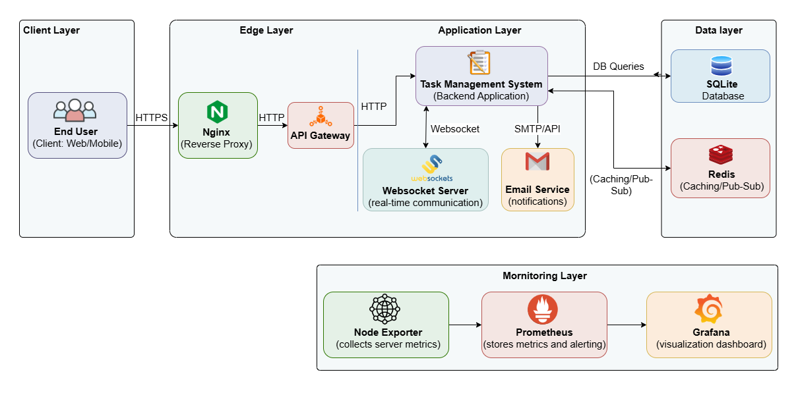

# EduTask Manager


## 📋 Description
**EduTask Manager** is a high-performance, real-time academic management platform designed specifically for university environments. It bridges the communication gap between faculty and students by centralizing task management, academic calendars, document sharing, and collaborative Q&A into a single, intuitive interface. 

Built on a robust REST API and WebSocket architecture, it ensures all stakeholders stay synchronized with instant updates across the board.

## ✨ Main Features
- **🔐 Secure Authentication & RBAC**: Advanced Role-Based Access Control for Admins, Teachers, and Students using JWT tokens.
- **📊 Real-time Kanban Board**: Interactive drag-and-drop board powered by Socket.IO for instant progress tracking across "To Do", "In Progress", and "Done".
- **✅ Task Lifecycle Management**: Support for hierarchical subtasks, priority levels (Low to Urgent), deadline monitoring, and audit-ready version history.
- **📅 Integrated Academic Calendar**: Manage class schedules, exams, and meetings with support for recurring events and automated email reminders.
- **📂 Centralized Document Hub**: Secure repository for uploading, categorizing, and sharing lectures, assignments, and reference materials.
- **💬 Collaborative Q&A Forum**: Structured academic discussions with threaded replies, "Accepted Answer" resolution, and automated summarization.
- **✉️ Direct Messaging**: Instant 1-1 chat functionality for seamless student-teacher communication.
- **🔔 Notification Engine**: Multi-channel alerts (In-app push + Email) triggered by system events and task assignments.
- **📈 System Observability**: Full observability stack with Prometheus metrics and pre-configured Grafana dashboards.

## 🛠️ Tech Stack
- **Backend**: Python 3.10+, [Flask 2.3](https://flask.palletsprojects.com/), [SQLAlchemy 2.0](https://www.sqlalchemy.org/)
- **Real-time Engine**: [Socket.IO](https://socket.io/), [Redis](https://redis.io/) (Message Broker), [Eventlet](https://eventlet.net/)
- **Frontend**: Modern Vanilla JavaScript (ES6+), HTML5 Semantic Structure, Responsive CSS3
- **Infrastructure**: [Docker](https://www.docker.com/), [Nginx](https://www.nginx.com/) (Reverse Proxy), [Gunicorn](https://gunicorn.org/)
- **Security**: [Flask-JWT-Extended](https://flask-jwt-extended.readthedocs.io/), [Bleach](https://github.com/mozilla/bleach) (XSS protection), [Flask-Talisman](https://github.com/GoogleCloudPlatform/flask-talisman) (CSP)
- **Monitoring**: [Prometheus](https://prometheus.io/), [Grafana](https://grafana.com/)

## 🚀 Installation

### Using Docker (Recommended)
The entire stack can be launched with a single command:
```bash
# Clone the repository
git clone https://github.com/quocdat2023/Taskmanager.git
cd Taskmanager

# Configure environment variables
cp .env.example .env

# Launch services
docker-compose up --build -d
```

### Manual Setup
1. **Prepare Environment**:
   ```bash
   python -m venv venv
   source venv/bin/activate  # Windows: venv\Scripts\activate
   pip install -r requirements.txt
   ```
2. **Initialize Database**:
   ```bash
   flask db upgrade
   ```
3. **Execute Application**:
   ```bash
   python run.py
   ```
The application will be accessible at `http://localhost:7860`.

## 📖 Usage Instructions
1. **User Onboarding**: Register an account as either Student or Teacher. Admins must manually approve new registrations.
2. **Academic Workflow**: Teachers create tasks and assign them to specific groups/students.
3. **Progress Tracking**: Students update task status on the Kanban board; changes are reflected instantly for Teachers.
4. **Academic Resources**: Access the document hub to download relevant course materials or use the Q&A forum for subject-specific queries.

## 📂 Project Structure
```text
EduTask-Manager/
├── app/                    # Core Backend & Frontend Application
│   ├── models/             # Database Definitions (User, Task, Chat)
│   ├── routes/             # REST API & Page Controllers
│   ├── services/           # Logic (Email, Notifications, AI Summaries)
│   ├── static/             # Client-side Assets (JS, CSS, Media)
│   └── templates/          # Jinja2 HTML Templates
├── grafana/                # Grafana Provisioning & Dashboards
├── prometheus/             # Monitoring Configuration
├── nginx/                  # Nginx Proxy & Load Balancer Config
├── scripts/                # Utility Scripts (Maintenance, CI/CD)
├── requirements.txt        # Backend Dependencies
└── docker-compose.yml      # Orchestration Config
```

## 🔐 Environment Variables
Configure the following in your `.env` file:
- `SECRET_KEY`: Main Flask application key.
- `DATABASE_URL`: Connection string (SQLite/PostgreSQL).
- `JWT_SECRET_KEY`: Secret string for token generation.
- `MAIL_SERVER` / `PORT`: SMTP configuration for email alerts.
- `MAIL_USERNAME` / `PASSWORD`: Credentials for the automated mailer.

## 🎥 Demo / Screenshots
*Refer to `SysDesign.png` for the system architecture diagram.*
*Full business requirements are documented in `BRD_TaskManager_v1.0.md`.*

## 🤝 Contributing
Contributions are welcome! Please follow these steps:
1. Fork the Project.
2. Create your Feature Branch (`git checkout -b feature/AmazingFeature`).
3. Commit your Changes (`git commit -m 'Add some AmazingFeature'`).
4. Push to the Branch (`git push origin feature/AmazingFeature`).
5. Open a Pill Request.

## ⚖️ License
Distributed under the **MIT License**. See `LICENSE` for more information.

## 👤 Author
**quocdat2023** - [GitHub](https://github.com/quocdat2023)
